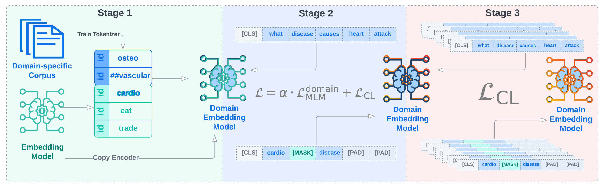

# MOSAIC

MOSAIC is a multi-stage framework for domain adaptation of sentence embedding
models via domain-specific vocabulary expansion and joint MLM–contrastive training.

This repository accompanies the paper:

**MOSAIC: Masked Objective with Selective Adaptation for In-domain Contrastive Learning**  
(EACL 2026, Findings)

📄 arXiv: https://arxiv.org/abs/2510.16797



## Key Features

* Domain-Restricted MLM: Masks only domain-specific tokens and restricts predictions to the domain vocabulary, preventing interference with general-purpose embeddings
* Joint Training: Combines contrastive learning with masked language modeling in a single training pass
* Weight Tying: Shares weights between input embeddings and MLM prediction head for parameter efficiency
* Flexible Configuration: Easy-to-modify YAML configs for different domains and training setups

## Code Structure

This repository is based on the open-source
[`contrastors`](https://github.com/nomic-ai/contrastors) framework and contains
a small number of targeted modifications required to implement MOSAIC.


## Usage (forthcoming)

1. Install dependencies following the original `contrastors` instructions.
2. Use the configuration files provided in `configs/`.
3. Data format follows the contrastors repo`.


## Quick Start

### 1. Prepare your data

Create a domain token IDs file (JSON list of token IDs for your domain vocabulary):
```json
[1234, 5678, 9012, ...]
```

### 2. Configure training

Edit `configs/train/contrastive_pretrain_biomedical.yaml`:
```yaml
train_args:
  mlm_weight: 0.3          # Weight for MLM loss
  mlm: true                # Enable MLM training

model_args:
  tokenizer_name: ""
  model_name: ""
  domain_token_ids_path: ".json"

data_args:
  mlm_prob: 0.15           # Masking probability
  domain_token_ids_path: ".json"
```

### 3. Run training
```bash
torchrun --nproc_per_node=2 src/contrastors/train.py \
    --config=configs/train/contrastive_pretrain_biomedical.yaml \
    --dtype=bf16
```

---

## Code Structure
```
contrastors/
├── src/contrastors/
│   ├── config.py                 # Training configuration
│   ├── train.py                  # Main training script
│   ├── trainers/
│   │   ├── base.py               # Base trainer with weight tying
│   │   └── text_text.py          # Contrastive + MLM trainer
│   ├── models/
│   │   ├── encoder/
│   │   │   └── modeling_nomic_bert.py  # Domain-restricted MLM
│   │   └── biencoder/
│   │       └── modeling_biencoder.py   # BiEncoder with MLM support
│   └── dataset/
│       └── text_text_loader.py   # Domain-aware data collator
└── configs/
    └── train/
        └── contrastive_pretrain_biomedical.yaml
```

This repository is based on the open-source [contrastors](https://github.com/nomic-ai/contrastors) framework.

---

## Citation
```bibtex
@misc{pavlova2026mosaicmaskedobjectiveselective,
      title={MOSAIC: Masked Objective with Selective Adaptation for In-domain Contrastive Learning}, 
      author={Vera Pavlova and Mohammed Makhlouf},
      year={2026},
      eprint={2510.16797},
      archivePrefix={arXiv},
      primaryClass={cs.CL},
      url={https://arxiv.org/abs/2510.16797}, 
}
```

---

## License

This project is released under the Apache 2.0 License, consistent with the
original `contrastors` codebase.
